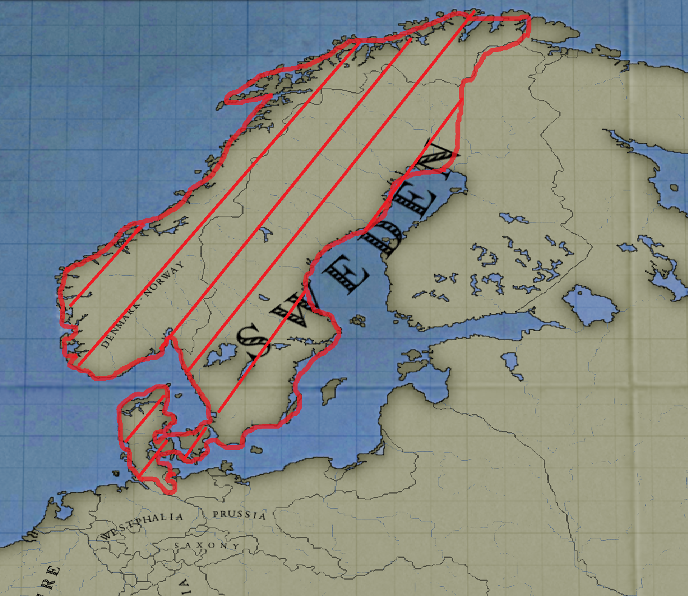
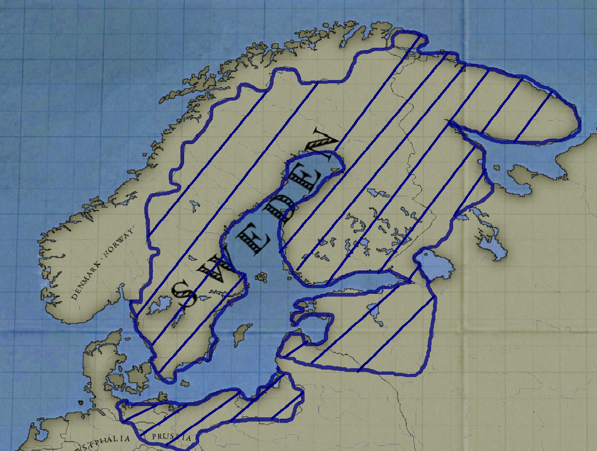

# The Scandinavian update

Hi everyone, let's talk about the upcoming Scandinavian update. 

## A bit of History

After the destruction of the Danish fleet for the 2nd time by the british during the Copenhagen battle in mid 1807, the Danes tried their best to recover and get their fleets back with financial helps from france who was lacking naval experience and ships following the Trafalgar's defeat. In the meantime, Sweden choosed Bernadotte as it's new king. As a former Napoleon's marshal, he sided with France in the european wars, even though he was mainly focused on Swedish interest. Thus, both Denmark and Sweden became allies to support Napoleon, one against the United Kingdom, the other against Russia. 

However, Sweden almost joined the coalition when Napoleon invaded their Germanic Possession of Pomerania. But he promised Sweden that this was only a temporary situation in order to increased it's surveillance of Prussia and secretly offered to help Sweden against Russia to reclaim Finland, using diplomacy first, and if Russia was to be disloyal, with military force. So when Russia traded with england, against the continental system and France, it was only too natural for Sweden and Denmark to join France.

They kept russia busy in Finland enabling Napoleon to crush a weaker russian army at Borodino and conquering Moscow with ease. The destruction of the Russian army, and the Swedish menace on St Petersburg forced Alexander the First to negociate a humiliating peace treaty with France. Sweden gained Finland back, Russia was forced into the continental system once more and the Duchy of Poland saw itself become a kingdom with considerable gain in the East.

After the English Crisis and the end of the Napoleonic wars, Sweden and Denmark slowly left France's influence to concentrate on a join effort to keep a check on Prussia, enabling Denmark to annex Holstein and Sweden to further it's influence on north Germany.

In 1836 the french influence is no longer a thing in Scandinavia and the only thing remaning from the Napoleonic era is the Bernadotte  family and some territory. The region inhabitant are speaking more and more of a Scandinavian union but Sweden is also looking at the Baltic see with great interest while Denmark has reconstruct it's mighty fleet with the goal to expand it's colonial Empire !

## New Decision

The general idea regarding the so called "Northern Lights" is to give them a choice between cooperation or rivality and hugely expanding their importance in game. 
For example, Danemrak and Sweden will be more powerful as allies since they both can get two different expansion path but a Scandinavia + britain is a lot more powerful than a Sweden or Danemark with full expansion (the same as Prussia and Austria)

### Denmark

Denmark has rebuilt it's fleet and will be offered 2 new expansion path incompatible with the formation of Scandinavia

- The first is based upon the reconstruction of the Kalmar Union, enabling Denmark to claim Swedish territory and Sweden as an accepted culture and later o, finnish. After the establishment of this union, new decisions will be able to get cores on baltic state as well as their cultures. Finally, they will be able to accept north german if they accept to expand their influence in Germany.

(The Cores of the Kalmar Union)

- The secondis based upon the reconquest of the British Isles, former possessions of the glorious vikings.They will be able to form the Norwegian empire, reclaiming lost territory and new techs giving boost for navies and armies.

### Sweden
- Sweden will be given a new expansion path which will beleading to the formation of the baltic empire, adding north german and batltic culture accepted. They will also get a unique event if conquer St  Petersburg and are allied to the Danes giving them huge buff(You'll have too discover that event by yourself)
- If Sweden was to sphere the nation of Mecklenburg, they will be given the possibility to annex it.

All baltic state will be able to take the path leading to the creation of the batlic empire, even Prussia (exception made for PLC and Russia as their technically not baltic country)

(The Cores of the Baltic Empire)

 

## Scandinavia

Scandinavia will have to choose between two new expansion path : 
- One which leads to the acceptance and conquest of the british Isles (same as Danemark, possible changes for balance), with the new tech
- One which gives north German accepted with Latvian and Estonian (same as Sweden, possible changes for balance)

## Territory

New states will be created in this expansion. 
- Every Island in the baltic will be their own state, reflecting the fact that those Island would theorically be important port. It will also make their conquest easier as the cost for each of them will be nothing, making them interestic strategic places.

  

- The Faroe Island will be their own state and the scotish one will be given to Danemark.

- The tiny Island of Helligoland will be given to Danemark as a result of the fleeding of the british monarchy

- The city of Lübeck will be given to Sweden as they were a lot more focus on Germany

- Sweden will gain core on the province of Stralsund

## Other things

- Some pops are going to be more Swedish or Danes (Helligoland and the Faroe Island will be 200% Danes while Lübeck and Stralsund will be more Swedish)
- If one owns St Petersburg, Copenhagen and every Baltic Isles at the same time, we will be able to select a decision which will increase taxes (to reflect the commercial activity)
- Denmark and Sweden will start as allies
- Both Denmark and Sweden will be allied to Westphalia and PLC (to reflect the reality of surveilling Prussia)
- Danemark will be given one factory of Steamer transport in Sjaelland
- Danemark will be given the Battleship Column Doctrine tech 
- Sweden will get the ideological thought tech
- Copenhagen will now have a lvl 2 port
- every Baltic Island will have a lvl 1 port
- Increase of Denmark's fleet (to 70 ships)
- Increase of Swedish fleet (30 ships)
- Less soldier pop for PPLC
- give UK a general
- increase conquest cb state requirement
- remove Russian truce of PC
- Budjak state to Russia
- fix and upgrade regarding preexisting decision and events
- Remove every PLC's core on Austria and Russia
- Give Prussia cores on Posen

## ANOTHER NORDIC WAR : 

After the defeat of Russia by the "Grande Armeee" and it's allies, Russia had to accept an humiliating peace treaty. It reintegrated the Continental system and ceded Finalnd + western land to PLC. 
Russia after this was in a poor shape. It had virtually no army, it's western land were either under PLC's occupation or suffering from the burnt earth tactics. It's economy collapsed after it rejoined the continental system and faced huge internal problem. 
Indeed, separatism was strong, specially in Estonia and Latvia whom the Swedish government was secretly offering help to. And in 1820, after a particularly bad harvest season, the Baltics people were starving and launched a rebellion against the Russian oppressor. Tey managed to secure ports to receive Swedish supply and to form somewhat of an army. But after the initial success, Russia sent it's professional army to deal with this revolt. Sensing that the tide turning, Sweden, using the excuses of sending food to feed the local population, seized the port as Russian army was closing in. Riga and the Island of Ösel fell without a fight and the local population was rejoiced to see that Sweden was coming to "help". 
The situation reached a stalemate in 1823, Russia was unable to completly defeat the revolt as it was using guerilla tactics but neither could the revolt push Russia out. Sweden, then, offered a solution. They would occupy the region and officialy make it Swedish state in exchange for money, as well as a guarantee that Sweden would not attack Russia.
Having difficulties against other revolts and desesperatly needing money and guarantee, Alexandrer the 1st and Bernadotte signed a treaty at St Petersburg. But the Russian never forget that the Baltics were once theirs.

Under the Swedish rule, the Baltic state prospered. They were given a lot of autonomy and Sweden invested a lot to repare the damage caused by the famine.
But in 1834, Russia started to gather armies at the border of ex-Estonia. Sweden, at the time , was busy in Germany, trying to keep it's little grip on this region, as Austria and Prussia had finally recovered from the Napoleonic wars. They just annexed the merchant city of Lübeck and were dealing with the remaining of the 20 days revolts as well as managing a diplomatic crisis with Prussia.
So when Russia launched detachment of Cosacs into the Baltic region, the only thing Sweden could do was call upon a diplomatic summit with the regions power : PLC, Sweden and Russia. The weak Russia had recovered and was ready for war. Even though PLC and Sweden were stronger than Russia, PLC just got out of the Galician crisis and wasn't sure about Austrian ambition. Thus, Sweden was practically left alone against Russia. And then, war was declared, the 21st August of 1835. Russia sent the 2 armies it had against Latvia and Estonia to occupy and destroy the port as soon as possible to prevent any Swedish landing. But it was late in the campaign season and supply was getting harder to find and move. But it also helped Russia siege down faster as the population didn't have that much food in the winter and they moved into Ösel using an ice bridge. At the same time, Valmiera was capptured and the City of Riga was in sight.
But the Swedes reacted with typical speed and the aging Bernadotte still had many surprise for the Russia. He quickly moved the army stationned in Russia in Estonia using the supperiority of the Swedish fleet and unbeknown to the Russian general Galriov, 2 Swedish armies arrived at Pärnu in late november while another moved from Liepaja to try to encircle the Russian army.
The Russian had 60k+ men in Valmiera and were still sacking the city when 2 Swedish armies where spotted north. Believing it to be an equal fight and still being influenced by the recent Russian victory, Galriov didn't took the time to check the field and simply put it's army in a classic battle formation.
The 2 armies clashed north of Valmiera and it seemed the forces were evenly matched. But when it'news arrived that a third Swedish army was approching south of their position, the general staff lost it's commanding capacity and slowly, the russian army disintegrated, losing 30 000 men to inguries, spoutanous surrender and desertion. In the Chaos, Galriov was shot by a canon ball and it's Lieutenant, Yuri, could only sent a messenger to the 5. Line Corps stationned in Pskov before we was forced to retreat west, toward Riga. 
Bernadotte still using what he learned during the Napoleonic campaign used that to sent an army to Jalvaga and another, with him at the lead, in Dorpat to make sure that the Russia army was encircled and that any reinforcement would bee stopped.
In the meantime, we had sent the fleet to destroy any attempt of the 1st Russian Line corps to retreat from Ösel by blowing up the ice bridge. The Swedish fleet then returned to Stockolm to supply and load everything needed to fight in the Baltic.
In late december 1835, the Russian Emperor sent an emissary to Stockolm to discuss term. Even though the Swedes inflicted a devastating blow to the Russian army, Estonia was falling into Russian hand and a lot of reinforcment were coming from Russia, 2 armies already spotted in Pskov and St Petersburg. Russia was confident in it's victory.
The good new for Sweden came the 30th December when PLC offered them help against Russia as the Galician crisis finally ended. All PLC was asking is Sweden to hold 3 month...
 
