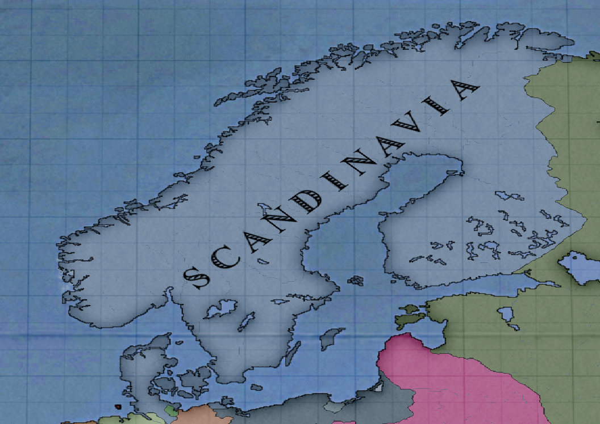
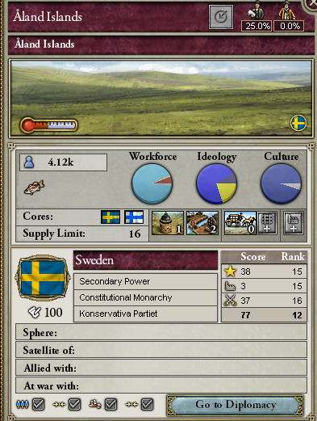
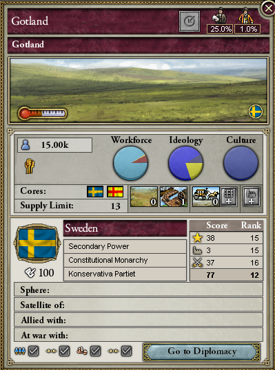
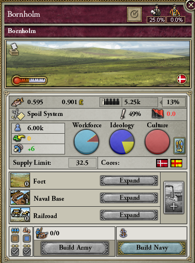
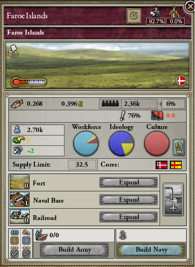
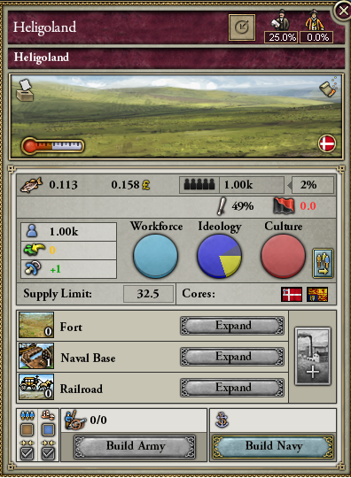
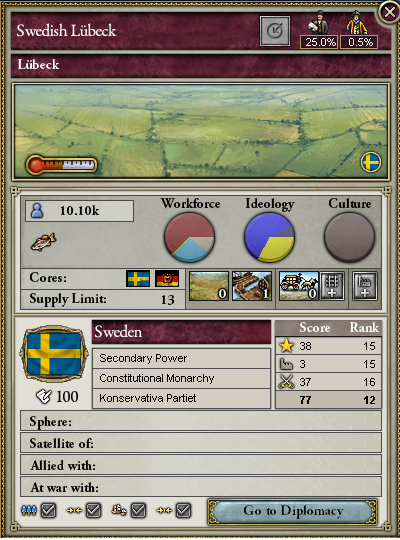
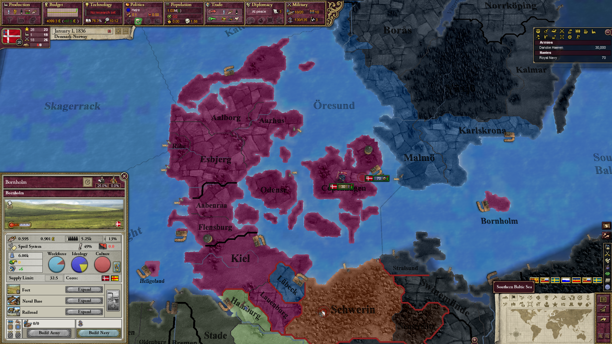
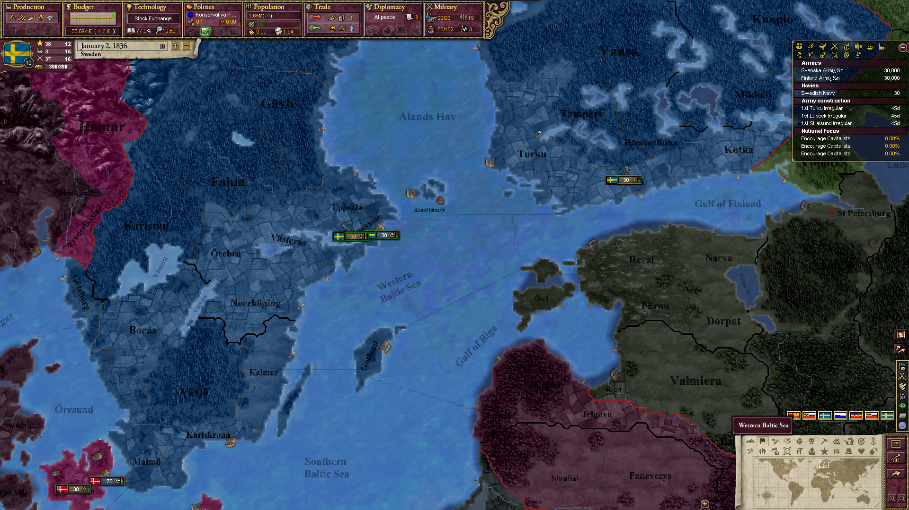

# The Scandinavian update

Hi everyone, let's talk about the upcoming Scandinavian update. 

## A bit of History

After the destruction of the Danish fleet for the 2nd time by the british during the Copenhagen battle in mid 1807, the Danes tried their best to recover and get their fleets back with financial helps from france who was lacking naval experience and ships following the Trafalgar's defeat. In the meantime, Sweden choosed Bernadotte as it's new king. As a former Napoleon's marshal, he sided with France in the european wars, even though he was mainly focused on Swedish interest. Thus, both Denmark and Sweden became allies to support Napoleon, one against the United Kingdom, the other against Russia. 

However, Sweden almost joined the coalition when Napoleon invaded their Germanic Possession of Pomerania. But he promised Sweden that this was only a temporary situation in order to increased it's surveillance of Prussia and secretly offered to help Sweden against Russia to reclaim Finland, using diplomacy first, and if Russia was to be disloyal, with military force. So when Russia traded with england, against the continental system and France, it was only too natural for Sweden and Denmark to join France.

They kept russia busy in Finland enabling Napoleon to crush a weaker russian army at Borodino and conquering Moscow with ease. The destruction of the Russian army, and the Swedish menace on St Petersburg forced Alexander the First to negociate a humiliating peace treaty with France. Sweden gained Finland back, Russia was forced into the continental system once more and the Duchy of Poland saw itself become a kingdom with considerable gain in the East.

After the English Crisis and the end of the Napoleonic wars, Sweden and Denmark slowly left France's influence to concentrate on a join effort to keep a check on Prussia, enabling Denmark to annex Holstein and Sweden to further it's influence on north Germany.

In 1836 the french influence is no longer a thing in Scandinavia and the only thing remaning from the Napoleonic era is the Bernadotte  family and some territory. The region inhabitant are speaking more and more of a Scandinavian union but Sweden is also looking at the Baltic see with great interest while Denmark has reconstruct it's mighty fleet with the goal to expand it's colonial Empire !

## New Decision

The general idea regarding the so called "Northern Lights" is to give them a choice between cooperation or rivality and hugely expanding their importance in game. 
For example, Danemrak and Sweden will be more powerful as allies since they both can get two different expansion path but a Scandinavia + britain is a lot more powerful than a Sweden or Danemark with full expansion (the same as Prussia and Austria)

### Denmark

Denmark has rebuilt it's fleet and will be offered 2 new expansion path incompatible with the formation of Scandinavia

- The first is based upon the reconstruction of the Kalmar Union, enabling Denmark to claim Swedish territory and Sweden as an accepted culture and later o, finnish. After the establishment of this union, new decisions will be able to get cores on baltic state as well as their cultures. Finally, they will be able to accept north german if they accept to expand their influence in Germany.
- The secondis based upon the reconquest of the British Isles, former possessions of the glorious vikings.They will be able to form the Norwegian empire, reclaiming lost territory and new techs giving boost for navies and armies.

### Sweden
- Sweden will be given a new expansion path which will beleading to the formation of the baltic empire, adding north german and batltic culture accepted. They will also get a unique event if conquer St  Petersburg and are allied to the Danes giving them huge buff(You'll have too discover that event by yourself)
- If Sweden was to sphere the nation of Mecklenburg, they will be given the possibility to annex it.

All baltic state will be able to take the path leading to the creation of the batlic empire, even Prussia (exception made for PLC and Russia as their technically not baltic country)

## Scandinavia

Scandinavia will have to choose between two new expansion path : 
- One which leads to the acceptance and conquest of the british Isles (same as Danemark, possible changes for balance), with the new tech
- One which gives north German accepted with Latvian and Estonian (same as Sweden, possible changes for balance)

## Territory

New states will be created in this expansion. 
- Every Island in the baltic will be their own state, reflecting the fact that those Island would theorically be important port. It will also make their conquest easier as the cost for each of them will be nothing, making them interestic strategic places.

- The Faroe Island will be their own state and the scotish one will be given to Danemark.

- The tiny Island of Helligoland will be given to Danemark as a result of the fleeding of the british monarchy

- The city of Lübeck will be given to Sweden as they were a lot more focus on Germany

- Sweden will gain core on the province of Stralsund

## Other things

- Some pops are going to be more Swedish or Danes (Helligoland and the Faroe Island will be 200% Danes while Lübeck and Stralsund will be more Swedish)
- If one owns St Petersburg, Copenhagen and every Baltic Isles at the same time, we will be able to select a decision which will increase taxes (to reflect the commercial activity)
- Denmark and Sweden will start as allies
- Both Denmark and Sweden will be allied to Westphalia and PLC (to reflect the reality of surveilling Prussia)
- Danemark will be given one factory of Steamer transport in Sjaelland
- Danemark will be given the Battleship Column Doctrine tech 
- Sweden will get the ideological thought tech
- Copenhagen will now have a lvl 2 port
- every Baltic Island will have a lvl 1 port
- Increase of Denmark's fleet (to 70 ships)
- Increase of Swedish fleet (30 ships)
- Less soldier pop for PPLC
- give UK a general
- increase conquest cb state requirement
- remove Russian truce of PC
- Budjak state to Russia
- fix and upgrade regarding preexisting decision and events
- Remove every PLC's core on Austria and Russia
- Give Prussia cores on Posen